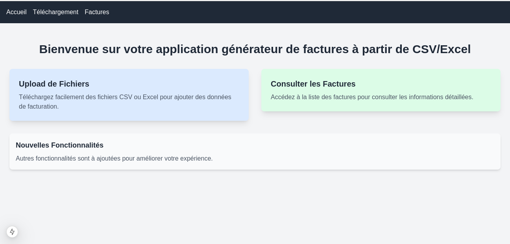
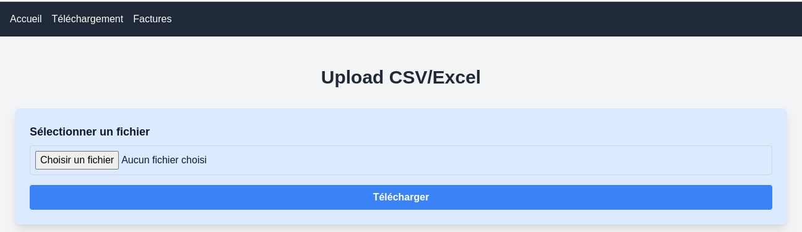
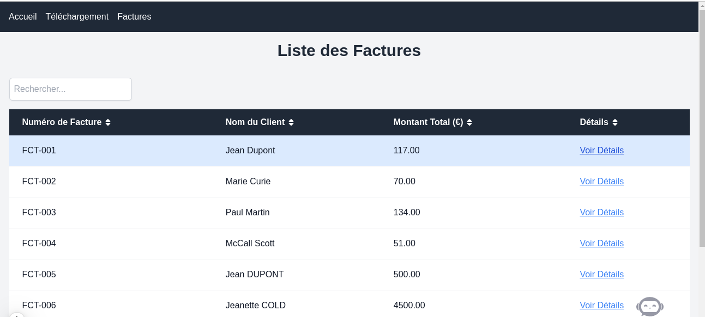
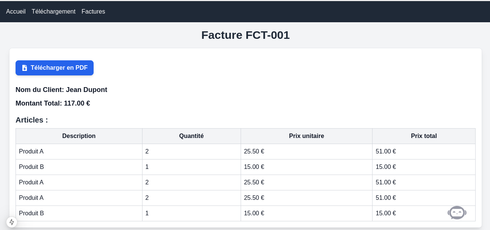

# Générateur de Factures à partir de CSV/Excel

## Présentation du projet

Ce projet est une application web permettant aux utilisateurs de télécharger des fichiers CSV ou Excel contenant des données de facturation. Le backend en Django traite les fichiers téléchargés, génère des factures individuelles et les enregistre dans la base de données. Le frontend en Next.js affiche une liste de toutes les factures et permet aux utilisateurs de consulter les détails de chaque facture.

 
 
 

## Exigences

### Technologies utilisées

- **Backend :**
  - Django
  - Django REST Framework
  - pandas (pour le traitement des fichiers CSV/Excel)
  - openpyxl (pour le traitement des fichiers Excel)

- **Frontend :**
  - Next.js
  - React

## Installation et Configuration

### Clonez le dépôt :

   ```bash
        git clone https://github.com/Lyrecoph/invoice_project
   ```

### Backend (Django)

1. **Naviguez vers le dossier backend :**

    ```bash
        cd backend
    ```

2. **Créez un environnement virtuel :**

    ```bash
        python -m venv venv
        source venv/bin/activate  # Sur Windows, utilisez `venv\Scripts\activate`
    ```

3. **Installez les dépendances :**

     ```bash
        pip install -r requirements.txt
    ```
4. **Configuration d'une variable d'environnement**

    Pour configurer le backend Django, créez un fichier `.env` dans le répertoire `backend/` et ajoutez les variables d'environnement suivantes :

    ```env
        # backend/.env

        # Django settings
        SECRET_KEY='Votre key'
        DEBUG=True

        # Database configuration
        DB_NAME=Nom de base de donnée
        DB_USER=Username
        DB_PASSWORD=mot de passe
        DB_HOST=hôte
        DB_PORT=5432

        # Allowed hosts
        # ALLOWED_HOSTS=localhost,127.0.0.1

        # Email settings (if needed)
        # EMAIL_HOST=smtp.example.com
        # EMAIL_PORT=587
        # EMAIL_HOST_USER=your_email@example.com
        # EMAIL_HOST_PASSWORD=your_email_password
        # EMAIL_USE_TLS=True
    ```

5. **Configurez la base de données :**

    Modifiez le fichier settings.py pour configurer la base de données (PostgreSQL).

    ```bash
        DATABASES = {
            'default': {
                'ENGINE': 'django.db.backends.postgresql',
                'NAME': config('DB_NAME'),
                'USER': config('DB_USER'),
                'PASSWORD': config('DB_PASSWORD'),
                'HOST': config('DB_HOST'),
                'PORT': config('DB_PORT', default='5432'),
            }
        }
    ```
    Assurez-vous d'avoir créé la base de données si nécessaire.

6. **Migrations de la base de données :**

     ```bash
        python manage.py migrate
    ```

7. **Lancez le serveur Django :**

     ```bash
        python manage.py runserver
    ```

Le backend sera accessible à l'adresse `http://127.0.0.1:8000/.`


### Frontend (Next.js)

1. **Naviguez vers le dossier frontend :**

    ```
    bash
        cd ../frontend
    ```

2. **Installez les dépendances :**

    ```
    bash
    npm install
    ```
3. **Configuration d'une variable d'environnement**

    Pour le frontend Next.js, créez un fichier .env.local dans le répertoire frontend/ et ajoutez la variable d'environnement suivante :

    ```env
    
        # frontend/.env.local

        # API URL for the backend
        NEXT_PUBLIC_API_URL=http://localhost:8000/api

    ```

3. **Configurez l'API :**

    Dans le fichier `next.config.ts`, vérifiez que l'URL de l'API backend est correctement définie. 
    Par exemple :

    ```
        bash
        typescript
        Copier le code
        const NEXT_PUBLIC_API_URL = process.env.NEXT_PUBLIC_API_URL || 'http://127.0.0.1:8000/api/';
    ```

4. **Naviguez vers le dossier invoices_front/ :**

    ```
    bash
        cd frontend/invoices_front/
    ```

5. **Démarrez le serveur Next.js :**

    ```
    bash
        npm run dev
    ```

Le frontend sera accessible à l'adresse `http://localhost:3000/`.

## Points de terminaison de l'API

1. ### Téléchargement de fichier

- URL : `/api/invoices/upload/`

- Méthode : `POST`

- Paramètres : Un fichier CSV ou Excel.

- Description : Télécharge un fichier contenant des données de facturation.

2. ### Liste des factures

- URL : `/api/invoices/`

- Méthode : `GET`

- Description : Récupère une liste de toutes les factures.

3. ### Détails d'une facture

- URL : `/api/invoices/{id}/`

- Méthode : `GET`

- Description : Récupère les détails d'une facture spécifique, y compris les articles et les totaux.

4. ### Télécharger une facture en format pdf

- URL : `/api/invoices/pdf/<str:numero>/'`

- Description : Télécharge un fichier sous format pdf contenant des données de facturation.

### Fonctionnalités

- Téléchargement de fichiers CSV ou Excel contenant des données de facturation.

- Génération automatique de factures à partir des données téléchargées.

- Affichage d'une liste de factures avec des détails de base (Numéro de facture, Nom du client, Montant total).

- Consultation des détails de chaque facture, incluant les articles et les totaux.

- Télécharger chaque facture au format PDF.


## License
Ce projet est sous licence MIT. Consultez le fichier LICENSE pour plus de détails.